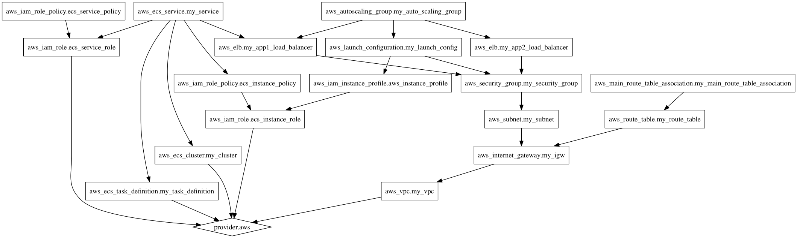

# terraform-fagdag
Prosjektet bruker Terraform til å sette opp to apps i en virtuel privat sky på AWS. 

## Kom i gang

1. Installer terraform, aws cli. Sett det opp ved å kjøre ```aws configure``` og legg til følgende miljøvariabel: ```AWS_DEFAULT_REGION="eu-west-1"```.

2. Opprett en fil kalt ```terraform.tfvars```i terraform mappen med følgende innhold:
```
aws_access_key = "<fyll inn aws access key>"
aws_secret_key = "<fyll inn aws secret key>"
```
3. Kjør dette i et terminalvindu 
```cd terraform && terraform apply```

4. Hent en kopp kaffe og nyt den i mens du venter i ca 6-10 minutter.
5. Besøk appene på output nettadressene du fikk i terminalen.

## Avhengighetsgraf 

```terraform graph | dot -Tpng > graph.png && open graph.png```

